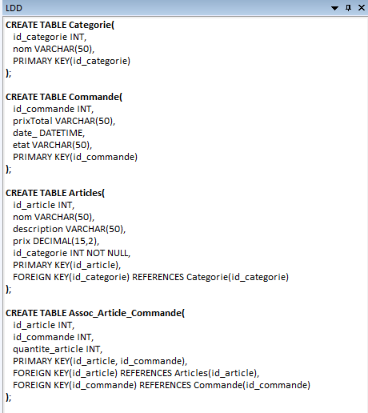

# **Projet : EatSmart**

**Étudiant :** Pierre

---

### **1. Description du projet**

EatSmart est une application web développée dans le cadre d’un projet de BTS.  
Son objectif est de permettre à un utilisateur de commander un repas via une interface intuitive, et de transmettre cette commande en cuisine via un système backend pour préparation.

L’application se divise en deux parties :
- **Frontend** : interface utilisateur pour passer des commandes.
- **Backend** : gestion des commandes reçues et administration du menu.

---

### **3. Fonctionnalités principales**

#### **3.1 Frontend (eatSmartFront)**

- **Interface de menu et de commande :**  
  L’utilisateur peut consulter les plats disponibles à la commande à travers une interface claire et interactive.

- **Passage de commande :**  
  Il est possible de sélectionner des plats, de personnaliser sa commande et de la valider.

- **Historique des commandes :**  
  L’utilisateur a accès à un historique visuel de ses précédentes commandes.

#### **3.2 Backend (eatSmartBack)**

- **Réception des commandes :**  
  Le serveur reçoit les commandes des utilisateurs afin de les transmettre au personnel de cuisine.

- **Gestion de la carte du restaurant :**  
  Les administrateurs peuvent ajouter, modifier ou supprimer des plats du menu proposé.

- **Historique des commandes :**  
  Les administrateurs peuvent consulter un historique détaillé des commandes passées.

---

### **4. Technologies utilisées**

- **Frontend :** HTML, CSS, JavaScript  
- **Backend :** PHP, API REST  
- **Base de données :** MySQL

---

### **5. Schéma de l'architecture Eatsmart**

### **6. Schéma du Modèle Conceptuel de Données (MCD)**

### **7. Schéma du Modèle Logique de Données (MLD)**

### **8. Schéma du Modèle Physique de Données (MPD)**

